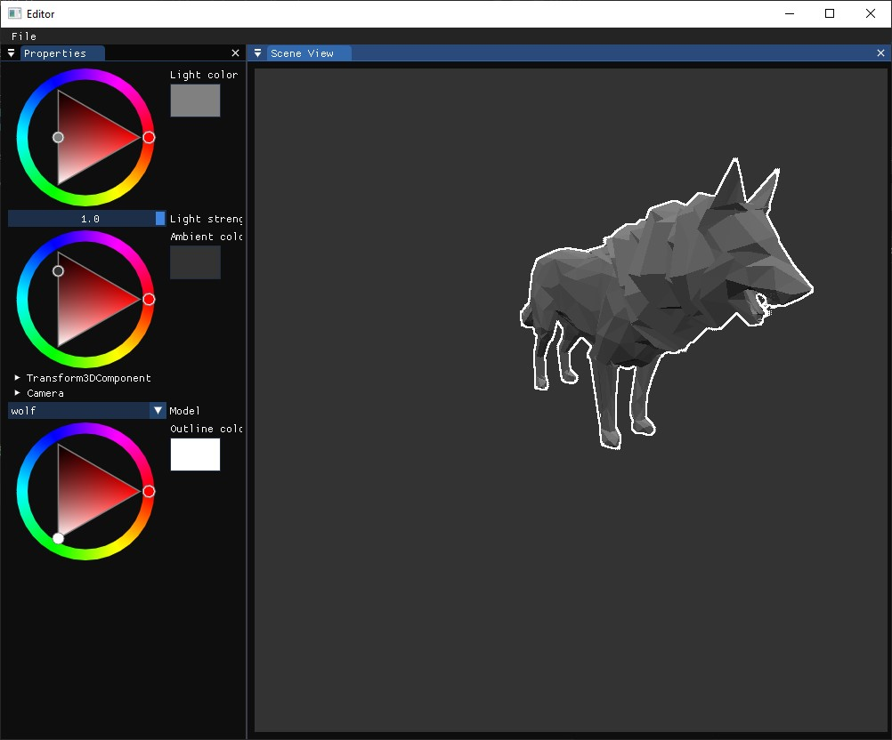
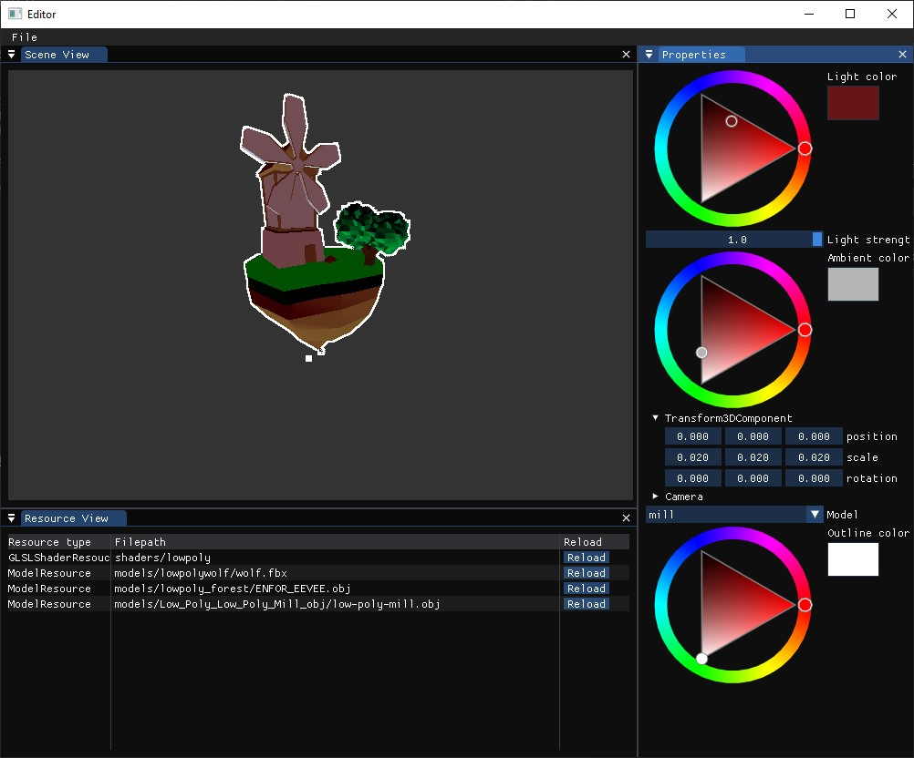

## RebornOffline

RebornOffline is  pretty basic rendering/game engine that I use as a place to learn C++ and some game engine stuff that are interesting to me.

The engine has 2 parts: "RebornEngine" that is a static library and "Editor" app that are build on top of it.

Interesting feachers of RebornEngine are:
 1. Own written Math that has aliases.
 ```c++

        Reborn::Vector3 position = Reborn::Vector3(1, 2, 3);
        LOG_DEBUG << position.zxy;
        LOG_DEBUG << position.xxx;
        Reborn::Vector4 redColor = Reborn::Vector4(1, 0, 0, 1);
        LOG_DEBUG << position.rgb;
```
 2. Own written resource system.
 ```c++
 const ModelResource* modelResource = resourceManager().getResourceOrCreate<ModelResource>("models/lowpolywolf/wolf.fbx");
 ```
 3. Own written Event system.
 4. Own written ECS system.

 Screenshots
 
 

Engine use this libraries:
 1. Assimp
 2. easylogging
 3. glad
 4. imgui
 5. SDL

P.S. For now project can be compiled only with MSVC compiler. All dependencies are embedded.